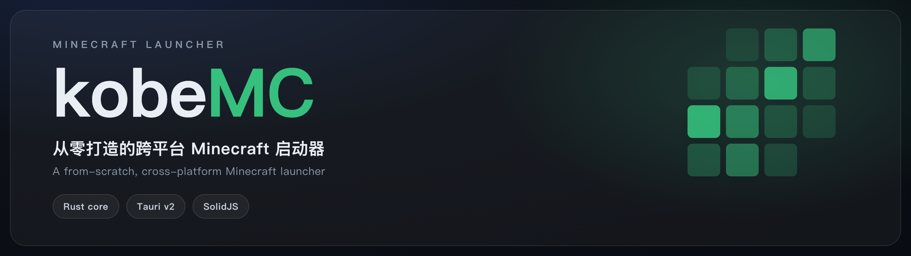

<p align="center">
  <picture>
    <source media="(prefers-color-scheme: dark)" srcset=".github/assets/banner-dark.png" />
    <source media="(prefers-color-scheme: light)" srcset=".github/assets/banner-light.png" />
    
  </picture>
</p>

<p align="center">
  A fast, from-scratch, cross-platform Minecraft launcher.<br />
  <b>Rust core + Tauri v2 + SolidJS shell</b> — the architecture designed in <a href="./docs"><code>docs/</code></a> and built from it.
</p>

> Status: **working MVP+**. The core engine actually launches Minecraft
> (vanilla **and** Fabric) end-to-end, verified on macOS arm64. See
> [Implementation status](#implementation-status).

## What works today (verified)

**Core launch**
- ✅ Fetch Mojang version manifest, install vanilla (jar + libraries + assets, parallel + checksum-verified)
- ✅ Library/native resolution incl. **1.19+ natives** with arm64/x64 disambiguation + rule eval
- ✅ Java auto-detection + version matching; **auto-download** (Adoptium JRE)
- ✅ **Launch the game** — vanilla 1.20.1 boots to full client init (LWJGL/OpenAL/textures)

**Loaders** (multi-component `inheritsFrom` merge)
- ✅ Fabric · ✅ Quilt — meta-API profile, install + launch verified
- ✅ Forge · ✅ NeoForge — headless official-installer flow

**Accounts**
- ✅ Offline · ✅ Microsoft device-code (Xbox→XSTS→MC) · ✅ Yggdrasil external login (authlib-injector)

**Content & instances**
- ✅ Modrinth search + **mod install with recursive dependency resolution** (Sodium verified)
- ✅ Local mod management (enable/disable/delete, reads `fabric.mod.json`/`mods.toml`)
- ✅ World management (level.dat NBT parse, backup, delete, rename)
- ✅ Resource pack / shader / datapack management
- ✅ Instance copy / delete (recycle bin) / **Modrinth `.mrpack` import & export**
- ✅ Crash log analysis (keyword rules → human cause + suggestions)
- ✅ Global settings persistence; BMCLAPI mirror routing

**Backend & infra**
- ✅ **Lite server** (`mc-server`, axum 0.8): loader-version aggregation, news, instance sharing, and **launcher accounts via [better-auth](https://github.com/better-auth-rs/better-auth-rs)** (email/password + sessions; social/passkey/2FA available as plugins)
- ✅ **Persistence on Supabase (Postgres via sqlx)** — better-auth users/sessions/accounts + shares, verified across restart
- ✅ Portable / multi-root game-directory discovery; crash-safe atomic writes; shared-store hardlink/reflink
- ✅ Desktop app: native rounded window + workspace view + classic adjustable-accent theme

> **224 passing tests.** UI exists but the current focus is the data layer + backend (see [docs/08](./docs/08-data-layer-and-lite-server.md)).

## Architecture

```
crates/
  mc-types/     纯数据 DTO(serde),core 与 UI 共享
  mc-core/      UI-free 引擎:version / download / java / auth / launch / loader / meta / modplatform / instance / paths
  mc-cli/       headless CLI(驱动并验证 core)
desktop/
  src-tauri/    Tauri v2 Rust 胶水(#[tauri::command] 包装 mc-core)
  src/          SolidJS 前端(theme 引擎 / 三区布局 / 组件 / 页面 / IPC)
docs/           设计文档(需求、链路、模块、选型、UI、目录模型)
```

The core is a pure library with **97 passing unit tests** and no UI dependency —
it compiles to a CLI today and the Tauri app tomorrow, exactly the "clean reusable
kernel" the reference launchers (PrismLauncher / PCL) aimed at. See
[`docs/04-rust-tauri-design.md`](./docs/04-rust-tauri-design.md).

## Build & run

Prerequisites: Rust (stable), Node 18+, a JRE (for actually launching the game).

### CLI

```bash
cargo build
target/debug/mc roots                 # discover game directories
target/debug/mc java                  # detect installed Java
target/debug/mc versions              # list installable versions
target/debug/mc install 1.20.1        # download a vanilla version
target/debug/mc launch 1.20.1 --name Steve     # launch offline
target/debug/mc fabric 1.20.1         # install Fabric (vanilla auto-installed)
target/debug/mc login                 # Microsoft device-code login
target/debug/mc --mirror install 1.20.1        # via BMCLAPI mirror
```

### Desktop app

```bash
cd desktop
npm install
```

**Dev mode** (hot reload). A *debug* Tauri binary loads the frontend from the Vite
dev server (`devUrl: localhost:1420`), so the server must be running first:

```bash
# terminal 1 — frontend dev server (must be up before launching the app)
npm run dev                                  # vite on :1420
# terminal 2 — the Tauri window (connects to :1420)
cd src-tauri && cargo run
# or, with the Tauri CLI installed, one command that does both:
cargo tauri dev
```

> If you `cargo run` the debug binary WITHOUT the dev server, the window is blank
> with "Could not connect to the server" — that's the run mode, not a UI bug.

**Standalone build** (embeds the frontend into the binary, no dev server needed):

```bash
npm run build                                # frontend → dist/
cd src-tauri && cargo build --release        # release embeds ../dist
./target/release/mc-launcher-desktop         # self-contained
```

## Implementation status (vs `docs/02-features.md`)

| Tier | Feature | State |
|------|---------|-------|
| MVP A1–A10 | manifest, vanilla install, verify, natives, offline+MSA login, java, command, launch | ✅ done |
| B1–B2 | Forge / **Fabric** install | ✅ Fabric · ⬜ Forge/NeoForge |
| B5–B6 | multi-component merge, instance isolation | ✅ done |
| B7–B9 | java auto-download, concurrency, retry | ✅ concurrency+retry · ⬜ JRE auto-download |
| B10 | Mod browse (Modrinth) | ✅ search · ⬜ install-into-instance |
| B12 | modpack import | ⬜ |
| C1–C3 | BMCLAPI mirror, URL rewrite | ✅ done |
| D1/D5 | theme engine (adjustable accent), dark/light | ✅ done |
| — | crash analysis, world mgmt, CurseForge, OptiFine, 联机大厅 | ⬜ backlog |

⬜ items are scaffolded by the architecture (the version system already supports
loader components; the download/task framework already supports any source) and
are the natural next increments.

## Docs

Start at [`docs/README.md`](./docs/README.md): requirements, the launch chain,
per-module design, tech-stack rationale, UI design, and the directory model.
